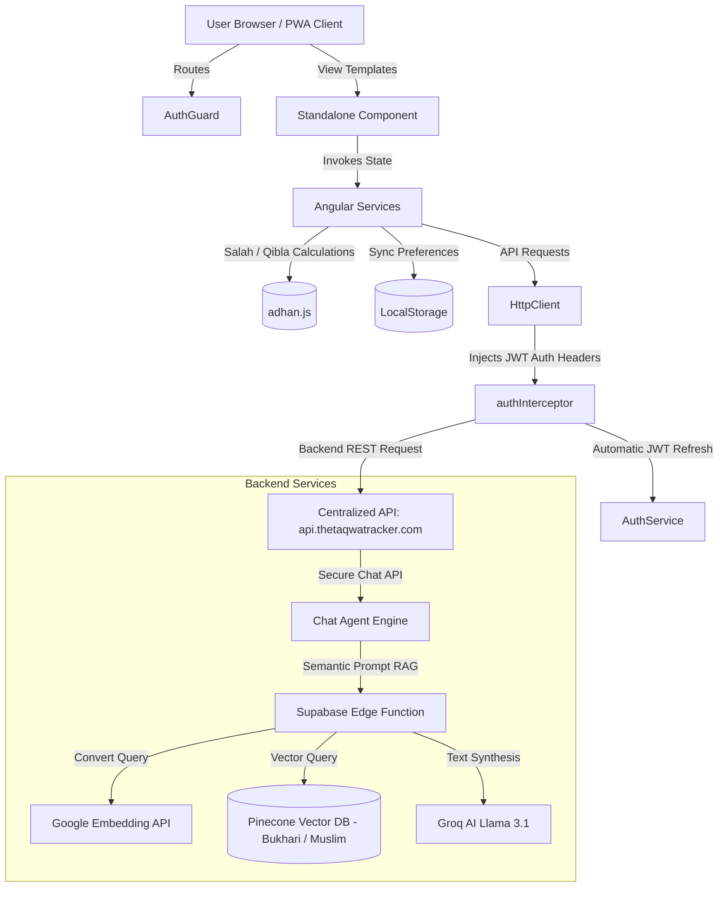

# Taqwa Tracker: Developer & AI Agent Context

Welcome to the **Taqwa Tracker** frontend codebase! This document provides context, design patterns, coding guidelines, and repository structure details to help developers and AI agents understand the system architecture, implement features correctly, and adhere to established code quality guidelines.

---

## 🚀 Technology Stack Overview

Taqwa Tracker is an Islamic Progressive Web App (PWA) built with modern frontend technologies, targeting responsiveness, offline capability, and clean interactive designs.

*   **Framework**: [Angular 21](https://angular.dev/) (utilizing **100% Standalone Components**)
*   **State Management**: Angular Signals (`signal`, `computed`, `effect`, `linkedSignal`)
*   **Change Detection**: `ChangeDetectionStrategy.OnPush` is strictly enforced across all components.
*   **Styling**: TailwindCSS 3.4+ with light/dark theme selectors, custom glassmorphism, and smooth animations.
*   **PWA Core**: Angular Service Worker (`ngsw-worker.js`) caching assets, static pages, and configuring caching policies.
*   **Key Libraries**:
    *   `adhan` (v4.4.3): Calculations for daily prayer times, Kaaba direction, and tahajjud/last third of the night.
    *   `moment-hijri` (v3.0.0): Accurate Hijri dates, conversions, and navigation adjustments.
    *   `ng2-pdf-viewer` (v10.4.0): For loading and displaying Islamic books/literature from host URLs.
    *   `marked` (v16.3.0) & `dompurify` (v3.3.1): Safe Markdown parsing and HTML sanitization for the chatbot interface.

---

## 📂 Project Directory Layout

```
taqwa-tracker-web/
├── docs/                             # Documentation files
│   └── edge_functions/               # Chatbot Edge Function architecture and APIs
├── public/                           # Static assets, fonts, icons, manifest.webmanifest
├── src/
│   ├── app/
│   │   ├── auth/                     # Authentication views (Login, Register, Password Reset)
│   │   ├── chatbot/                  # AI Islamic Chatbot UI components
│   │   ├── feedback/                 # User feedback forms
│   │   ├── guard/                    # Router guards (e.g., authGuard)
│   │   ├── header/                   # App navigation, sidebar menus, and Settings panels
│   │   ├── home/                     # Core Dashboard and nested features:
│   │   │   ├── games/                # Mini-games: Quiz, Memory, Word-Search, Journey, Salah-Master
│   │   │   ├── sacred/               # Quran Reader, Hadith Browser, PDF Library Viewer
│   │   │   ├── tool/                 # Zakat Calculator, Calendar, Qibla Compass, Tasbih
│   │   │   └── widgets/              # Reusable widget cards (e.g. Prayer countdown widget)
│   │   ├── interceptor/              # HTTP Interceptors (JWT token injection & auto-refresh)
│   │   ├── model/                    # DTOs, interfaces, and state representations
│   │   ├── pipes/                    # Custom formatting pipes
│   │   ├── service/                  # Core services (Auth, Salah, Theme, Streak tracking, etc.)
│   │   └── shared/                   # Global components (PWA install banners, PDF readers, etc.)
│   ├── environments/                 # Development vs Production settings files
│   ├── main.ts                       # App bootstrapper
│   └── styles.css                    # Base and utilities styling
```

---

## 🔄 Core Architecture & Flow Diagram

The diagram below details the interaction flow between the client interface, services, API endpoints, and AI backend edge functions:



---

## 🛠️ Critical Domains & Code Patterns

### 1. Prayer Calculation Engine (`SalahAppService`)
*   Located at: [salah-app.service.ts](file:///workspaces/taqwa-tracker-web/src/app/service/salah-app.service.ts)
*   Integrates the `adhan` library with two key modes:
    *   **Hanafi Mode**: Triggered by the `isHanafi` (Signal). Uses `CalculationMethod.MoonsightingCommittee()`, set `Madhab.Hanafi` (Asr shadows are 2x object height), and set `Shafaq.Abyad` (for white twilight / later Isha time calculation).
    *   **Standard Mode**: Uses `CalculationMethod.MuslimWorldLeague()` and `Madhab.Shafi` (Asr shadows are 1x object height).
*   **Tahajjud Calculation**: Calculates the best window using the last third of the night (`SunnahTimes.lastThirdOfTheNight`).
*   **Geolocation & Reverse Geocoding**: Automatically prompts for browser geolocation, and calls OpenStreetMap's reverse geocoding API to resolve the neighborhood/city layout.

### 2. AI Islamic Chatbot (`ChatbotService`)
*   Located at: [chatbot.service.ts](file:///workspaces/taqwa-tracker-web/src/app/service/chatbot.service.ts)
*   **Response Generation**: Queries the `/chat/agent` backend with a UUID `conversation_id`.
*   **Safety & Sanitization**: The service parses the response using `marked` for Markdown structure and sanitizes it using `DOMPurify` to avoid any possibility of Cross-Site Scripting (XSS) when rendering answers using `[innerHTML]`.

### 3. JWT Interceptor & Refresh Lifecycle (`authInterceptor`)
*   Located at: [auth.interceptor.ts](file:///workspaces/taqwa-tracker-web/src/app/interceptor/auth.interceptor.ts)
*   Automatically appends `Authorization: Bearer <token>` to requests if authenticated.
*   Catches `401 Unauthorized` responses and triggers the refresh token loop via `AuthService.refreshSession()`.
*   To avoid circular dependencies, it references `AuthService` dynamically using Angular's dependency injection `Injector.get(AuthService)`.

---

## ⚠️ Coding Guidelines & Best Practices for AI Agents

When working on this repository, you **MUST** follow these rules:

1.  **Strict OnPush Change Detection**: Every newly created or modified component must configure `changeDetection: ChangeDetectionStrategy.OnPush` inside its `@Component` decorator.
2.  **Angular Signals for State**: Use signals for all local component states. Avoid manual subscriptions to RxJS behaviors where signals are suitable. Use `computed()` for derived computations, and `linkedSignal()` when syncing dependent states.
3.  **Cross-Site Scripting (XSS) Prevention**: Never render dynamically constructed strings in `[innerHTML]`. Always route them through the `ChatbotService.convertToHtml()` or utilize `DOMPurify` to secure content.
4.  **No Placeholders**: Always provide meaningful mock datasets, styling boundaries, and realistic representations.
5.  **Relative Imports**: Do not use absolute aliases unless configured in `tsconfig.json`. Use clean relative paths (e.g., `../../service/theme.service`).
6.  **Responsive Tailwind CSS**: Stick to Tailwind CSS classes for layouts. Implement proper dark-mode variants (`dark:...`) and glassmorphic card patterns matching the design system.
7.  **Environment Settings**: Configuration keys (API hosts, tokens, paths) must be written in both [environment.ts](file:///workspaces/taqwa-tracker-web/src/environments/environment.ts) and [environment.prod.ts](file:///workspaces/taqwa-tracker-web/src/environments/environment.prod.ts) files.

---

## 🛠️ Verification & Development Commands

Always run these verification steps before proposing your changes:

*   **Run Development Server**: `npm start` (Runs app on `http://localhost:4200`)
*   **Build Production Bundle**: `npm run build` (Ensures Ahead-of-Time (AOT) compilation and Service Worker generation succeeds without errors)
*   **Run Unit Tests**: `npm test` (Runs test suite via Karma/Jasmine)

---

## 🚀 Initialization & Setup

1.  **Clone the Repository**:
    ```bash
    git clone <repository-url>
    cd taqwa-tracker-web
    ```
2.  **Install Node Modules**: Ensure you are on Node.js 20+.
    ```bash
    npm install
    ```
3.  **Configure Environments**:
    Populate `src/environments/environment.ts` and `src/environments/environment.prod.ts` with required API keys, Map endpoints, and backend URLs.
    *   **api.map**: Should point to `https://nominatim.openstreetmap.org/reverse`
    *   **apiBaseUrl**: The centralized API backend (e.g., `https://api.thetaqwatracker.com`)

---

## 🛣️ Routing Architecture

The application strictly utilizes **lazy-loaded standalone components** across the board. 
When navigating to different parts of the application (like `quran`, `hadith`, `calculator`), they are dynamically loaded via `loadComponent: () => import(...)` to ensure a fast initial load. Check `app.routes.ts` for details.
*   **Auth Guard**: Routes such as `profile` and `calculator/contributions` are secured via the `canActivate: [authGuard]` strategy.
*   **Component Input Binding**: `withComponentInputBinding()` is enabled in `app.config.ts`, meaning router parameters can be directly captured as component inputs (`@Input()`).
